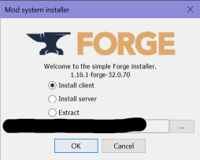
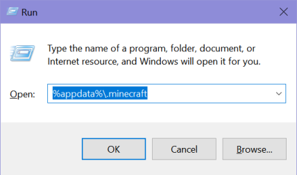

# 🧇 SoapiestWaffles' Offical Minecraft ModPack 📦

## Installing

### Prerequisites

* Java runtime installed (Download installer from https://www.java.com)
* SoapiestWaffles has added you to the server's whitelist

### 1) Getting the modpack

Latest release can be found at: https://github.com/soapiestwaffles/minecraft-modpack/releases

### 2) Set up MC Forge

* Unzip SoapiestWaffles' official Minecraft modpack to a path you can find easily
* Open the directory containing the extracted files from the modpack
* Double-click on the `Forge-1.16-1-[version]-installer.jar` to launch the Forge installer
* Ensure `Install client` is selected and click the `OK` button. The path in edit box should already be correctly pointing to your Minecraft installation

### 3) Add Mods to Minecraft

* If you are using Windows:
  * Press `WindowsKey-R` to open the "run" window
  * In the edit box, type `%appdata%\.minecraft` and click `OK`

  

  * A new explorer window of files will appear -- See if a folder already exists named `mods`. If it does not exist, create a new folder named `mods` in this window
  * Open the `mods` folder inside `%appdata%\.minecraft` and also open the `mods` folder from inside the SoapiestWaffles' official Minecraft modpack
  * Copy or move all the files from inside the `mods` folder from inside the SoapiestWaffles' official Minecraft modpack into the `mods` folder inside `%appdata%\.minecraft`

### 4) Launch Minecraft

* Open the Minecraft launcher. In the bottom left, make sure `Forge` is selected. If it says something else such as `Latest Release`, click on it and change it to `Forge`
* Click PLAY!

## Upgrading

Upgrading mods follows this same pattern, except your `mods` directory in `%appdata%\.minecraft` will already be populated with the old version of the mods. Before copying over files
from the modpack, be sure and delete everything (**EXCEPT YOUR OPTIFINE MOD** [see below]) inside the `%appdata%\.minecraft\mods` folder first.

### OPTIFINE

Optifine is not a part of this modpack -- be sure when cleaning out the old mods in your `%appdata%\.minecraft\mods` directory to **NOT DELETE** your Optifine mod.
